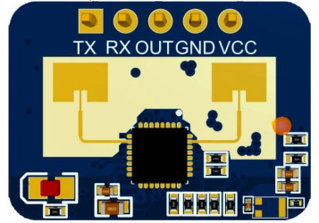

# MyLD2410 Arduino library
## Introduction

This library covers the complete set of commands for the HLK-LD2410x presence sensor. 
It has no external dependencies and will work on any Arduino and ESP32 board.



## Installation

1. It is recommended to install this library from the Arduino Library Manager (search for "MyLD2410"). However, if the Arduino Library Manager does not find it, or you prefer to install it yourself, download or clone this repository.

    - Unzip the downloaded archive in the Arduino/libraries folder. 

    - Restart the Arduino IDE.

1. Include the header file: `#include <MyLD2410.h>` in your sketch.

## Usage
* Decide which **hardware** serial stream you'll be using for communication. For 5V Arduino boards you must use a voltage divider (1:2 or 2:3) on the TX line to protect the RX pin of the sensor, which operates at 3.3V.  

`#define sensorSerial Serial1`


|  Board | Serial | RX pin | Tx pin |
|--------|--------|:--:|:--:|
| Adruino Nano 33 IoT | Serial1 | D1 | D0 |
| ESP32 WROOM-32 | Serial1 | 16 | 17 |
| Xiao-ESP32-c3 | Serial0 | D7 | D6 |
| Xiao-ESP32-c6 | Serial0 | D7 | D6 |

* Create a global instance of the sensor object

`MyLD2410 sensor(sensorSerial);`

* In the `setup()` function, begin serial communication with baud rate `LD2420_BAUD_RATE` (256000). On ESP32-WROOM: RX_PIN(16), TX_PIN(17). Check the exact pin numbers for your board. Then call `sensor.begin()` to begin communication with the sensor.

```
sensorSerial.begin(LD2410_BAUD_RATE, SERIAL_8N1, RX_PIN, TX_PIN);
if (!sensor.begin()) {
  Serial.println("Failed to communicate with the sensor");
  while (true);
}
```

* In the `loop()` function, call as often as possible `sensor.check()`. This function returns:
    
    1. `MyLD2410::DATA` if a data frame is received
    
    1. `MyLD2410::ACK` if a command-response frame is received
    
    1. `MyLD2410::FAIL` if no useful information was processed

* Use the many convenience functions to extract/modify the sensor data (see the examples below).

## Examples
* Once the library is installed, navigate to: `File->Examples->MyLD2410` to play with the examples. They are automatically configured for some popular 3.3V boards (see the table above). For other boards, minor (trivial) modifications may be necessary.  
    
    1. `sensor_data` - retrieves all data frames from the sensor and outputs useful information every second. Handles both basic and enhanced (engineering) modes.
    
    1. `print_parameters`- prints the current device parameters.

    1. `modify_parameters` - demonstrates how to modify various sensor parameters. At the end, the original state of the sensor is restored.

    1. `factory_reset` - restores the factory default values of the sensor parameters.

    1. `set_bt_password` - sets a new Bluetooth password, or resets the password to its default value "HiLink". _Be careful not to get locked out of your sensor._ 
    
        - The password must be 6 characters long. If you enter a longer password (on line 54), it will be truncated to 6 characters. 
        
        - If you provide a shorter one, it will be padded with spaces (0x20). 
        
        - To restore the default password, uncomment the line `#define RESET_PASSWORD` and flash the sketch again.
